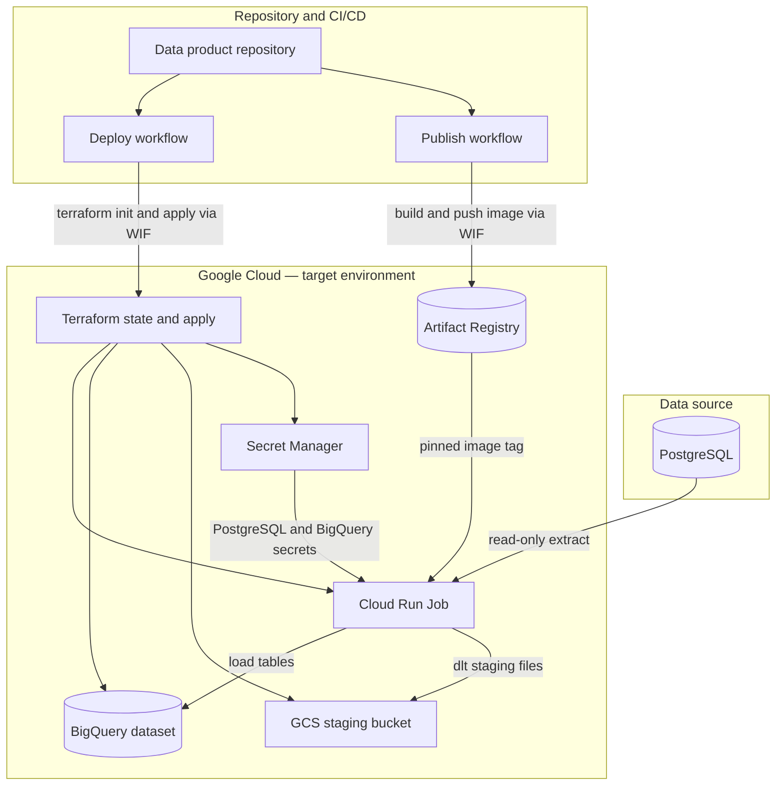

# Blueprint: PostgreSQL → BigQuery ingest (DPDS-driven)

## What this blueprint is about

The blueprint defines a **governed ingest** on **Google Cloud**: read-only **PostgreSQL** extracts (one or more schemas, same logical table) flow through a containerized runner into **BigQuery**, with **GCS** staging, **Secret Manager** credentials, **Terraform** infrastructure, and **GitHub Actions** for build and deploy.

The **Python** application implements a fixed pipeline (extract → your transform hook → JSON Schema validation → **dlt** load); **business column mapping** should be implemented in `application/transform_hook.py` after instantiation.

## Data product use case

**Problem:** You need a repeatable pattern to land PostgreSQL data into BigQuery under a **single output contract**, with infrastructure and delivery aligned to **environments** (for example `dev`, `prod`).

**Out of scope for the blueprint itself:** Detailed business rules inside the generic modules (those live in the hook), the **output port column map** (declared in the instantiated descriptor, not as a blueprint parameter), provisioning the remote Terraform state bucket, and automatic reconciliation of every possible source column to the output without your hook logic.

### High-level architecture

At runtime the **Cloud Run Job** runs the containerized pipeline (extract → `transform_hook` → validation → **dlt** load). The pipelines **Publish** and **Deploy** respectively deliver the image and apply Terraform per environment; credentials never live in the repo.

## Data Product LifeCycle

### Data product instantiation

**When the data product repository is instantiated**, the orchestrator builds a Velocity context, evaluates each `.vm` file above and writes the corresponding rendered artifacts. Every **non-template** file from the blueprint—`application/` (including `application/transform_hook.py`), static `infrastructure/*.tf`, `Dockerfile`, `blueprint-manifest.yaml`, and the rest of the scaffold—is **copied unchanged** into the new repo so it is a complete project. 

**Velocity templates** (`.vm` files) in this blueprint are the parameterized sources. They are:

| Template                                     | Typical output in the data product repository |
| -------------------------------------------- | --------------------------------------------- |
| `descriptor/data-product-descriptor.json.vm` | `descriptor/data-product-descriptor.json`     |
| `.github/workflows/publish.yml.vm`           | `.github/workflows/publish.yml`               |
| `.github/workflows/deploy.yml.vm`            | `.github/workflows/deploy.yml`                |
| `README.md.vm`                               | `README.md` at the repository root            |
| `infrastructure/backend.tf.vm`               | `infrastructure/backend.tf`                   |

### Data product publication

**Publish** (rendered `.github/workflows/publish.yml`) builds and pushes the ingest runner container image to Artifact Registry. It is typically triggered by a semantic version tag (`v*.*.*`) or manual workflow dispatch with an explicit `image_tag` input.

During **Publish**, the rendered workflow typically:

- Checks that `descriptor/data-product-descriptor.json` exists and is valid JSON (for example with `python -m json.tool`).
- Installs the runner package with `pip install -e ./application`.
- Runs `terraform fmt -check -recursive infrastructure`, then `terraform init -backend=false -input=false` and `terraform validate` under `infrastructure/` (validate-only; no remote state).
- Authenticates to Google Cloud using **Workload Identity Federation** and the manifest parameters `wif_provider` and `wif_service_account`.
- Configures Docker for Artifact Registry, builds the ingest image, and pushes it with the resolved `image_tag`.

Publishing does **not** run **Terraform apply** against your environments; it only produces an **immutable image reference** (registry URI + tag) that **Deploy** consumes later.

### Data product deployment

**Deploy** (rendered `.github/workflows/deploy.yml`) runs **Terraform apply** for **one** manifest **`environments`** value and **one** **`image_tag`** that was already produced by **Publish**.

During **Deploy**, the workflow typically:

- Checks out the repository.
- Resolves `environment` and `image_tag`: from **workflow_dispatch** (inputs `environment`—must match a descriptor `lifecycleInfo` key—and `image_tag`), or from **repository_dispatch** with event type `deploy-ingest` and `client_payload` fields `environment` and `image_tag`.
- Authenticates to Google Cloud using Workload Identity Federation with the manifest parameters `wif_provider` and `wif_service_account`.
- Runs `terraform init` in `infrastructure/` against the remote GCS backend using `TF_STATE_BUCKET` / `TF_STATE_PREFIX` (from instantiated manifest: `tf_state_bucket_address`, `tf_state_prefix`).
- Runs `terraform apply -auto-approve` in `infrastructure/`, passing (among others) `gcp_project_id`, `gcp_region`, `environment`, `data_product_name` (`dpName`), `gcs_staging_bucket`, `bq_dataset_id`, `bq_partition_field`, `bq_cluster_fields_csv`, `cursor_field`, `row_discriminator_column`, `postgres_secret_id`, `bigquery_secret_id`, `artifact_registry_repository`, `cloud_run_job_name`, `image_name`, and `image_tag`.

That apply **creates or updates**:

- The **BigQuery** dataset for loads.
- The **GCS** staging bucket used by **dlt**.
- The **Cloud Run Job** pinned to the published container `image_tag`, plus the job **service account** and **IAM** needed for BigQuery, GCS, and Secret Manager access.
- **Secret Manager** mounts (paths) for PostgreSQL and BigQuery credentials on the job.

**After a successful deploy**, operators **run the Cloud Run Job** (on demand, Cloud Scheduler, or another orchestrator) to execute an ingest.

## Normative references

- [DPDS](https://dpds.opendatamesh.org/specifications/dpds/)
- [Apache Velocity](https://velocity.apache.org/engine/devel/user-guide.html)
- [Blueprint Manifest](https://github.com/opendatamesh-initiative/odm-platform-pp-blueprint-server/tree/main/src/main/java/org/opendatamesh/platform/pp/blueprint/manifest)

## Where to go next

- **Python pipeline and modules:** `[application/README.md](../application/README.md)`
- **Manifest parameters and protected paths:** `[blueprint-manifest.yaml](../blueprint-manifest.yaml)` at repository root

